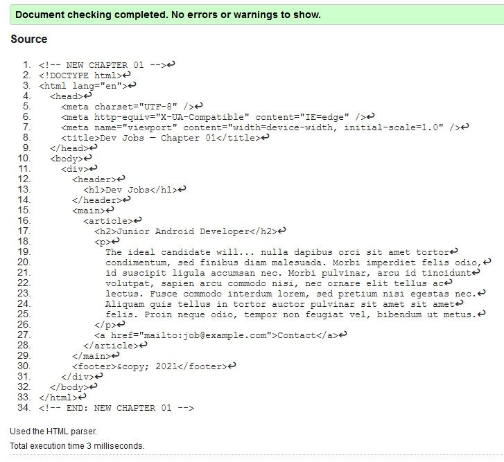
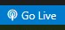
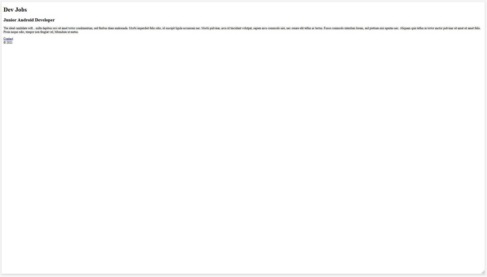

# Chapter 01: HTML

Our goal for this chapter will be to set up our project directory, and generate a very minimal HTML template for our application that we can build upon in future chapters.

## HTML Fundamentals

If you consider yourself to have only a basic level familiarity with HTML structure, do yourself a favour and check out the [fantastic HTML resource on MDN](https://developer.mozilla.org/en-US/docs/Learn/HTML/Introduction_to_HTML).

In our application we would like to follow as many best practices as we can, so that means establishing a good foundation of [semantic](https://developer.mozilla.org/en-US/docs/Glossary/Semantics#semantics_in_html) HTML tags to maximize [accessibility](https://developer.mozilla.org/en-US/docs/Web/Accessibility) (also known as A11y) and [SEO](https://developer.mozilla.org/en-US/docs/Glossary/SEO).

## The Application Shell

We will begin by creating the initial template for our application. Web servers by default will look for a file called `index.html` in the requested directory to send to the browser, so let's create that file now.

You can right click in VS Code's file explorer area on the left (toggle with `ctrl+b`) and select `"New file"`, or alternatively create the file on your terminal with the `touch` command:

```bash
touch index.html
```

Now open up your `index.html` in your preferred [IDE](https://en.wikipedia.org/wiki/Integrated_development_environment). If you are using VS Code and type the `!` character, you will be prompted with a context menu that simple shows `!` and `!!!`. Select the single `!` to automatically generate a HTML5 template.

If you are not using VS Code simply copy this code into your `index.html` file:

```html
<!DOCTYPE html>
<html lang="en">
  <head>
    <meta charset="UTF-8" />
    <meta http-equiv="X-UA-Compatible" content="IE=edge" />
    <meta name="viewport" content="width=device-width, initial-scale=1.0" />
    <title>Document</title>
  </head>
  <body></body>
</html>
```

If you're not familiar with all the different parts that are generated with this template, do yourself a favour and circle back to the MDN link in the [fundamentals](#html-fundamentals) section.

Let's begin with a very basic structure that almost all websites will follow: the header, the main content and footer. You'll also usually see a nav as well but we don't need one quite yet.

Our template will look like this:

```html
...
<body>
  <div>
    <header></header>
    <main></main>
    <footer></footer>
  </div>
</body>
```

Note that the ellipsis `...` indicates we are expanding on the previous code template, everything above the body in the `<head>` tag is still there, but unchanged.

We have wrapped the three main components of our app in a `<div>` tag as well to make it easier to treat them as one entity when applying styles later.

We can also update the document [title](https://developer.mozilla.org/en-US/docs/Web/HTML/Element/title) which among other things, will appear as your app name on your browser tab.

```html
...
<title>Dev Jobs</title>
...
```

## The Header and Footer

The main title of the current page/view of your application should always use an `<h1>` tag. Currently we don't have any content for the footer, so a simple copyright message will suffice.

```html
...
<body>
  <div>
    <header>
      <h1>Dev Jobs</h1>
    </header>
    <main></main>
    <footer>&copy; 2021</footer>
  </div>
</body>
```

The `&copy;` is an [HTML Entity](https://developer.mozilla.org/en-US/docs/Glossary/Entity) that will render on your actual app as the copyright symbol.

## The Main Content

Take a moment to look back at the `Introduction` where we reviewed the requirements given to us when we were hired. Our application must be able to present four key pieces fo information about jobs that are available.

It's important to remember that we are currently focusing on our role as a _front end developer_. We are not concerned at the moment with the shape of data that we will be querying from the backend. Instead let's focus on the requirements for the display of the data. With that in mind, we have enough information to construct a template that meets these requirements.

Here we introduce the semantic [article](https://developer.mozilla.org/en-US/docs/Web/HTML/Element/article) tag which is used to describe complete groups of information that can exist on its own, even outside the context of the rest of the page:

```html
...
<body>
  <div>
    <header>
      <h1>Dev Jobs</h1>
    </header>
    <main>
      <article>
        <h2>Junior Android Developer</h2>
        <p>
          The ideal candidate will... nulla dapibus orci sit amet tortor
          condimentum, sed finibus diam malesuada. Morbi imperdiet felis odio,
          id suscipit ligula accumsan nec. Morbi pulvinar, arcu id tincidunt
          volutpat, sapien arcu commodo nisi, nec ornare elit tellus ac lectus.
          Fusce commodo interdum lorem, sed pretium nisi egestas nec. Aliquam
          quis tellus in tortor auctor pulvinar sit amet sit amet felis. Proin
          neque odio, tempor non feugiat vel, bibendum ut metus.
        </p>
        <a href="mailto:job@example.com">Contact</a>
      </article>
    </main>
    <footer>&copy; 2021</footer>
  </div>
</body>
```

For the summary content we can use a [lorem ipsum generator](https://www.lipsum.com/) to create some real-looking fake text content.  We would expect the summary of a job posting to potentially be quite long, so we want to have some lengthy test content to ensure our app handles it properly.

Again we are not concerned yet with how things _look_ on the page. We are focused on good structure. With [CSS](https://developer.mozilla.org/en-US/docs/Web/CSS) we'll be able to format and style this content any way that we like.

## HTML Validation

Things are looking good. This might be a good point to verify that we are writing valid HTML. We mentioned some of the benefits above already in terms of accessibility and SEO. You can copy and paste our current template into this [HTML Validation Tool](https://validator.w3.org/#validate_by_input).

Everything passes!



## Viewing our App

Now that our most basic HTML structure is complete, before we begin to apply styles we need some way to see the output of our work. The best way to do this is with a [web server](https://developer.mozilla.org/en-US/docs/Learn/Common_questions/What_is_a_web_server).

A web server, specifically an [HTTP server](https://developer.mozilla.org/en-US/docs/Glossary/HTTP) is a piece of software designed to deliver content from one device to another. In our case that content is an HTML file, and we are delivering it to our web browser which will display it for us.

There are many quick and easy ways to run a web server locally and view files hosted directly on your own device. The web domain you will be using is [localhost](https://en.wikipedia.org/wiki/Localhost), which is a standard alias for `127.0.0.1`, your machine's own local IP address.

You will also need to specify which [port](https://developer.mozilla.org/en-US/docs/Glossary/Port) to use. It doesn't really matter which port you use as long as it's not already being used by another service on your machine. All `HTTP` traffic on the web by default uses port 80. For our purposes to avoid stepping on any toes we will use `8080` unless the tool specifies it for us.

### Option 1: Live Server VS Code Extension

If you are using VS Code the easiest way is probabaly installing the `Live Server` extension (extension id `ritwickdey.liveserver`). Simply install the extension and a `Go Live` icon will appear on the blue bar at the lower right corner of VS Code.



Aftering clicking it you will be able to view your web page at whatever port the server decides, the default URL being [http://localhost:5500]()

### Option 2: Python3 web server

If you are on Ubuntu or any machine that has Python 3 installed, then you can run a simple webserver with the following command:

```bash
sudo python3 -m http.server 8080
```

Then access your web page at [http://localhost:5500]()

### Option 3: Node web server

If you have [node.js](https://nodejs.org/en/download/) installed already on your machine (you will need if for later parts of this tutorial series) then you will automatically have [npx](https://nodejs.dev/learn/the-npx-nodejs-package-runner) installed as well (not to be confused with [npm](https://nodejs.dev/learn/an-introduction-to-the-npm-package-manager)).

Run the following command:

```bash
npx http-server -p 8080
```

It will prompt you to install `http-server` if it is not installed already. Afterward you can access your web page at [http://localhost:8080]()

## Wrapping Up

If all went well and you were able to set up one of the three webserver options, you should see our "app" visible on `localhost`. It will look something like this:



Which is fantastic!

It may not look like much, but it ticks all the important boxes:

- Valid, semantic HTML
- Fully accessible
- Fast & performant
- Works in all browsers (even really old ones!)
- Mobile support

So we are well on our way. In the next chapter we will look at introducing CSS to add styles and begin getting our layout in place.
