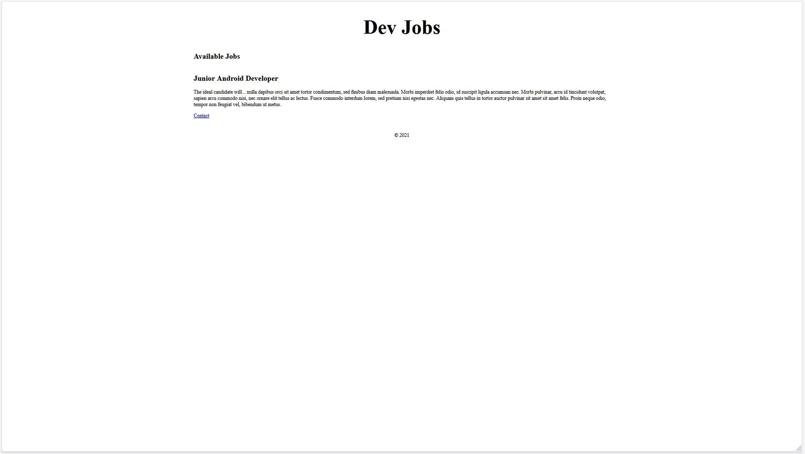
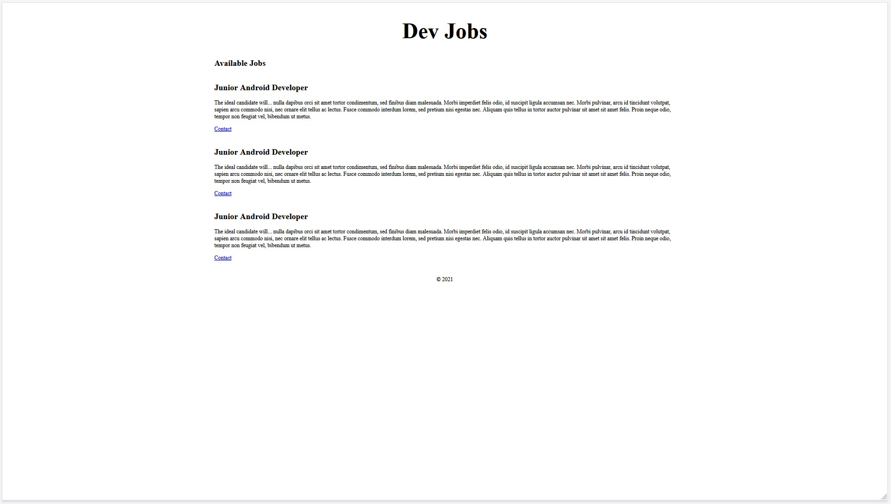

# Chapter 02: CSS

Our goal for this chapter will be to implement some basic CSS in our application, and get the fundamentals in place so that we can easily scale them up later.

At minimum we would like to achieve:

- All content to be centered on the page
- Sufficient space between the content
- Styles applied to all job postings (not just our single example)

## CSS Fundamentals

Before diving in we want to make sure we understand the basic [CSS Fundamentals](https://developer.mozilla.org/en-US/docs/Learn/Getting_started_with_the_web/CSS_basics), most important of all is the [Box Model](https://developer.mozilla.org/en-US/docs/Learn/CSS/Building_blocks/The_box_model).

## Flexbox & Grid

When it comes to building the layout of our application, our primary weapon is going to be [CSS Flexbox](https://developer.mozilla.org/en-US/docs/Learn/CSS/CSS_layout/Flexbox).

Flexbox is a powerful tool building complex web layouts. Although [CSS Grid](https://developer.mozilla.org/en-US/docs/Web/CSS/grid) has some advantages when it comes to full page layouts, we're going to stick with Flexbox for this tutorial as it is the most versatile layout tool.

Two great resources for learning Flexbox:

- [Flexbox Froggy](https://flexboxfroggy.com/) (interactive game)

- [Flexbox Cheatsheet](https://css-tricks.com/snippets/css/a-guide-to-flexbox/) (quick reference guide)

Once you consider yourself fluent with Flexbox, getting comfortable with Grid is the next natural step to improve your skills. Although we are not using it for this tutorial, there is another great teaching game for Grid as well:

- [CSS Grid Garden](https://cssgridgarden.com/)

## CSS Selectors

It is also important to have a solid understanding of [CSS Selectors](https://developer.mozilla.org/en-US/docs/Web/CSS/CSS_Selectors).

I can't stress enough how valuable selectors can be. Not only will they improve the way you write and compose CSS, they will even improve your Javascript skills as well through the powerful `document.querySelector` function which can grab and manipulate DOM nodes based on the value fo CSS selectors.

Two great resources for learning selectors:

- [CSS Diner](https://flukeout.github.io/) (interactive game)

- [CSS Selectors Cheatsheet](https://www.freecodecamp.org/news/css-selectors-cheat-sheet/) (quick reference guide)

## Implementing CSS in our Application

First we will need a file to place our CSS. Either create `styles.css` using your [IDE](https://en.wikipedia.org/wiki/Integrated_development_environment) or run the following command while you are in the same directory as your `index.html` file:

```bash
touch styles.css
```

Next we need to link the `styles.css` file to our application so the styles are applied. Add a [link](https://developer.mozilla.org/en-US/docs/Web/HTML/Element/link) tag to the `<head>` of our `index.html` file:

`index.html`
```html
<head>
  ...
  <link rel="stylesheet" href="styles.css" />
  ...
</head>
```

We'll begin by making the `body` of our application a `flex` container. Flex containers span the full width of their parent by default and make it very easy to centre content. Add the following to `styles.css`:

`styles.css`
```css
body {
  margin: 0;
  display: flex;
  justify-content: center;
}
```

The styles inside will only be applied to the `<body>` tag in the app. We use `justify-content` to move all the content to the centre of the parent. The `margin:0` is used to remove the default margin that is applied to all pages by most browsers.

You won't see the content quite centred yet because the amount of text is so much it spans the entire screen. We'll be adding a `max-width` soon to mitigate this.

Next we will add some [class](https://developer.mozilla.org/en-US/docs/Web/HTML/Global_attributes/class) tags to our HTML elements. This will give us some keywords that we can target with our CSS selectors to both apply styles, and manipulate the content using Javascript later:

`index.html`
```html
...
<header>
  <h1 class="app-title">Dev Jobs</h1>
</header>
<main>
  <section class="jobs">
    <header class="jobs-header">
      <h2 class="jobs-title">Available Jobs</h2>
    </header>

    <article class="job-post">
      <h2 class="job-post-title">Junior Android Developer</h2>
      <p class="job-post-summary">
        The ideal candidate will... nulla dapibus orci sit amet tortor
        condimentum, sed finibus diam malesuada. Morbi imperdiet felis odio, id
        suscipit ligula accumsan nec. Morbi pulvinar, arcu id tincidunt
        volutpat, sapien arcu commodo nisi, nec ornare elit tellus ac lectus.
        Fusce commodo interdum lorem, sed pretium nisi egestas nec. Aliquam quis
        tellus in tortor auctor pulvinar sit amet sit amet felis. Proin neque
        odio, tempor non feugiat vel, bibendum ut metus.
      </p>
      <a class="job-post-contact-email" href="mailto:job@example.com"
        >Contact</a
      >
    </article>
  </section>
</main>
...
```

Notice how we used consistent prefixes on the classes. Everything inside of the `job-post` class also begins with `job-post`, for example `job-post-title`. This is a common practice to create hierarchy and avoid accidentally creating multiple unrelated clases with the same name. When you get into more advanced CSS engines there are options for handling this automatically, but for now this is a good best practice to get into.

You can learn more about CSS class and stlying best practices [here](https://developer.mozilla.org/en-US/docs/Learn/CSS/Building_blocks/Organizing).

Regardless of what practices you choose, the most important part is to be consistent within your application. Consistency of a methodolgy is even more important than the methodolgy itself.

With these classes in place we can now update our `styles.css` file to apply some additional styles to our application:

`styles.css`
```css
/* Global */
body {
  margin: 0;
  display: flex;
  justify-content: center;
}

/* App */
.app {
  max-width: 1024px;
}

.app-title {
  font-size: 48px;
  text-align: center;
}

.app-footer {
  text-align: center;
  margin-bottom: 24px;
}
```

Notice that we added a `max-width:1024px` to the `div` that wraps our main application. This is a common practice to keep the content from getting too wide on large screens and giving a more standardized viewing experience to users regardless of screen size.

At this point our app looks like:



Depending on your screen size it may look a little different. If you screen resoltuion is `1024px` or below (or you shrink your screen to test the mobile experience) the content will squish all the way to the edge. We'll address this with a bit of `padding` in the next section.

## More Sample Jobs

Next let's improve our simulation of real content by simply copy + pasting everything inside of our `<article>` tag two more times to create 3 mock posts instead of the one.

`index.html`
```html
...
<section class="jobs">
  <header class="jobs-header">
    <h2 class="jobs-title">Available Jobs</h2>
  </header>

  <article class="job-post">
    <h2 class="job-post-title">Junior Android Developer</h2>
    <p class="job-post-summary">
      The ideal candidate will... nulla dapibus orci sit amet tortor
      condimentum, sed finibus diam malesuada. Morbi imperdiet felis odio, id
      suscipit ligula accumsan nec. Morbi pulvinar, arcu id tincidunt volutpat,
      sapien arcu commodo nisi, nec ornare elit tellus ac lectus. Fusce commodo
      interdum lorem, sed pretium nisi egestas nec. Aliquam quis tellus in
      tortor auctor pulvinar sit amet sit amet felis. Proin neque odio, tempor
      non feugiat vel, bibendum ut metus.
    </p>
    <a class="job-post-contact-email" href="mailto:job@example.com">Contact</a>
  </article>

  <article class="job-post">
    <h2 class="job-post-title">Junior Android Developer</h2>
    <p class="job-post-summary">
      The ideal candidate will... nulla dapibus orci sit amet tortor
      condimentum, sed finibus diam malesuada. Morbi imperdiet felis odio, id
      suscipit ligula accumsan nec. Morbi pulvinar, arcu id tincidunt volutpat,
      sapien arcu commodo nisi, nec ornare elit tellus ac lectus. Fusce commodo
      interdum lorem, sed pretium nisi egestas nec. Aliquam quis tellus in
      tortor auctor pulvinar sit amet sit amet felis. Proin neque odio, tempor
      non feugiat vel, bibendum ut metus.
    </p>
    <a class="job-post-contact-email" href="mailto:job@example.com">Contact</a>
  </article>

  <article class="job-post">
    <h2 class="job-post-title">Junior Android Developer</h2>
    <p class="job-post-summary">
      The ideal candidate will... nulla dapibus orci sit amet tortor
      condimentum, sed finibus diam malesuada. Morbi imperdiet felis odio, id
      suscipit ligula accumsan nec. Morbi pulvinar, arcu id tincidunt volutpat,
      sapien arcu commodo nisi, nec ornare elit tellus ac lectus. Fusce commodo
      interdum lorem, sed pretium nisi egestas nec. Aliquam quis tellus in
      tortor auctor pulvinar sit amet sit amet felis. Proin neque odio, tempor
      non feugiat vel, bibendum ut metus.
    </p>
    <a class="job-post-contact-email" href="mailto:job@example.com">Contact</a>
  </article>
</section>
...
```

And lastly, let's add some space between those job posts to give them room to breathe. We will add some margin around the top and bottom of all our articles using the `.job-post` class selector. The `>` character indicates we are targeting any `article` tags that are direct children of the `jobs` class.

We have also added some small `padding` to the left & right sides of the jobs container itself to keep it from running right to the edges when viewing on mobile:

`styles.css`
```css
/* ... */
.app-footer {
  text-align: center;
  margin-bottom: 24px;
}

/* Jobs */
.jobs {
  padding: 0 12px;
}

.jobs > article {
  margin: 32px 0;
}
```

## Wrapping Up

Let's boot up our application and take a look. At the end of this chapter we should now be looking like this:



In the next chapter we'll look at implementing the job submission form.