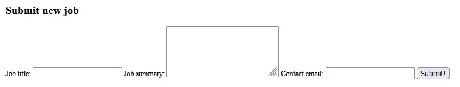
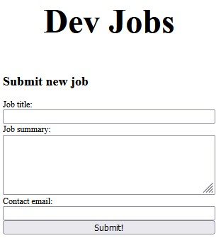
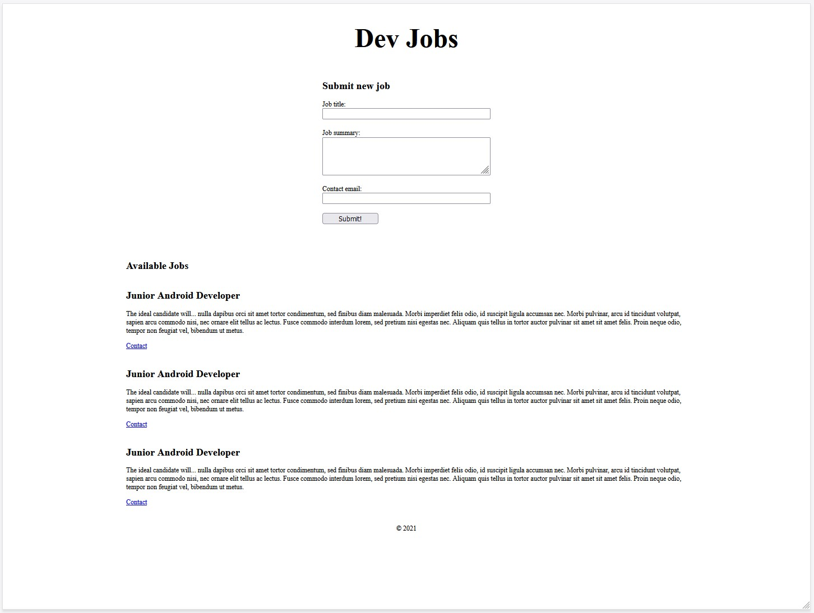

# Chapter 03: Form

Our goal for this chapter will be to implement a form so that employers have the ability to post new jobs on our application. For this chapter our focus is entirely the form itself, additional features like adding the job to our list and persisting the jobs after page refresh etc, will come later.

[Forms in web development are deceptively complex](https://developer.mozilla.org/en-US/docs/Learn/Forms). When you use a well designed for it feels like such a simple thing, yet they are consistently one of the most difficult components to implement properly. Here's a non-exhaustive list of the things you need to consider when designing a form:

- Input validation (numbers, email, empty fields, etc)
- Accessibility (keyboard navigation and proper labelling)
- Parsing form data (different character sets, languages, etc)
- Error handling (when/where to show error messages)
- Styling states (focused, disabled, etc)

In my experience the #1 way to deal with these challenges whenever possible is to _let the browser do its job_. The core tags already come bundled with much of what you need to make an accessible form with validation and error handling. Of course it's true that you should [never trust user input](https://xkcd.com/327/), however any backend developer will appreciate basic form validation to minimize the most common errors before the data payload is sent.

So with that said, let's dive into our most basic form implementation:

## Implementing the Job Submission Form

`index.html`
```html
<form class="job-form">
  <h2>Submit new job</h2>

  <label for="job-form-title">Job title:</label>
  <input required type="text" id="job-form-title" name="job-form-title" />

  <label for="job-form-summary">Job summary:</label>
  <textarea
    required
    id="job-form-summary"
    name="job-form-summary"
    rows="4"
  ></textarea>

  <label for="job-form-contact-email">Contact email:</label>
  <input
    required
    type="email"
    id="job-form-contact-email"
    name="job-form-contact-email"
  />

  <button type="submit">Submit!</button>
</form>
```

The `<form>` tag provides a nice wrapper around all of our inputs that we can use to style them. It also comes bundled automatically with the behavior for submitting the data with the `type="submit"` attribute on the `button`.

Clicking that button will automatically send the data from each of the input fields to the web server, and then trigger a page refresh. Give it a try!

If you tried it you may have noticed that your browser won't allow the submission to occur without entering valid values into these fields. The `required` attribute is what enforces the _cannot be empty_ behavior and the `type="email"` enforces a basic email pattern for the _contact email_ field before the browser will allow the form to be submitted.

Once you have met those conditions you should see that your browser refreshes, the form field values are cleared (because of the page refresh) and you can actually see these values displayed within the URL itself. This is called a `query string` and these values a called [parameters](https://developer.mozilla.org/en-US/docs/Learn/Common_questions/What_is_a_URL#parameters), and this is the most basic way to send form data to a web server without any need for Javascript.

An example submission from our app:

```
http://localhost:8080/chapter-03/index.html?job-form-title=sample+job&job-form-summary=sample+summary&job-form-contact-email=sample%40example.com
```

Before moving onto the styling of the form, it's worth pointing out another useful element, the [fieldset](https://developer.mozilla.org/en-US/docs/Web/HTML/Element/fieldset) element is used to group similar inputs together within a form. It also supports a `<legend>` for easy labelling of the group.  Although we don't have any use for it at this point, it's an extremely useful and often overlooked tool in form design.  

## Styling the Form

At this point our form, with no styling, will look something like this (depending on your browser):



We'll start by focusing on the `main` wrapper around the `form` and the `jobs` section, as well as the `form` itself. We don't want the form to be as wide as the job postings, and we'd like it to be centred in the middle. Let's apply our knowledge of Flexbox to accomplish this. Below the `.app-title` styles we will add two new selectors:

`styles.css`
```css
/* ... */
.app-title {
  font-size: 48px;
  text-align: center;
}

main {
  display: flex;
  flex-direction: column;
  align-items: center;
}

form {
  width: 300px;
  display: flex;
  flex-direction: column;
  margin-bottom: 48px;
}
/* ... */
```

This gets us much of the way there. Our form will be `300px` wide and centered within the bounds of our `<main>` element.



Our inputs are a bit squished together, and our button is unnecessarily wide. Let's address these two things next:

`styles.css`
```css
/* ... */
form {
  width: 300px;
  display: flex;
  flex-direction: column;
  margin-bottom: 48px;
}

form input,
form textarea {
  margin-bottom: 16px;
}

form button {
  width: 100px;
}
/* ... */
```

Something unfamiliar here might be the use of the space in the selector, for example `form input`. This is similar to the `>` character that meant _all direct children_. The space character simply means _all children_ no matter how deeply nested they are. Here is a [handy reference guide](https://www.w3schools.com/cssref/css_selectors.asp).

With that we've given some margin to the bottom of the inputs that are inside our form, and we've shrunk our button too. If we end up using a button elsewhere outside of the form it will not apply these styles, so we may decide later that we simply want to use the `button` select on its own to set all buttons in our app to `100px`. This will suffice for now.

## Accessibility

It's worth noting some of the simple things we've implemented to help make our form accessible. The label with the `for="..."` attribute will create a direct relationship between that label and the `id` of the form element that it is referring to, allowing different kinds of assitive technology to make the form as easy as possible to fill out.

Most major browsers have an [accessibility](https://developer.mozilla.org/en-US/docs/Web/Accessibility) tab when you open up the dev tools. For example in [Firefox](https://support.mozilla.org/en-US/kb/accessibility-features-firefox-make-firefox-and-we). Chrome has similar features as well.

One thing that's easy to test is keyboard navigation: try putting down your mouse and filling out our form using only the `tab` (forward) and `shift+tab` (backward) navigation. You'll find that it's perfectly possible to fill out and submit our form (hit enter on button focus) without using the mouse at all.

## Wrapping up

Here's how our app now looks on a 1440x1080 screen:

In the next chapter we will look at implementing Javascript to collect the form submission data and add new job submissions to our list, without yet implementing any services on the backend.


