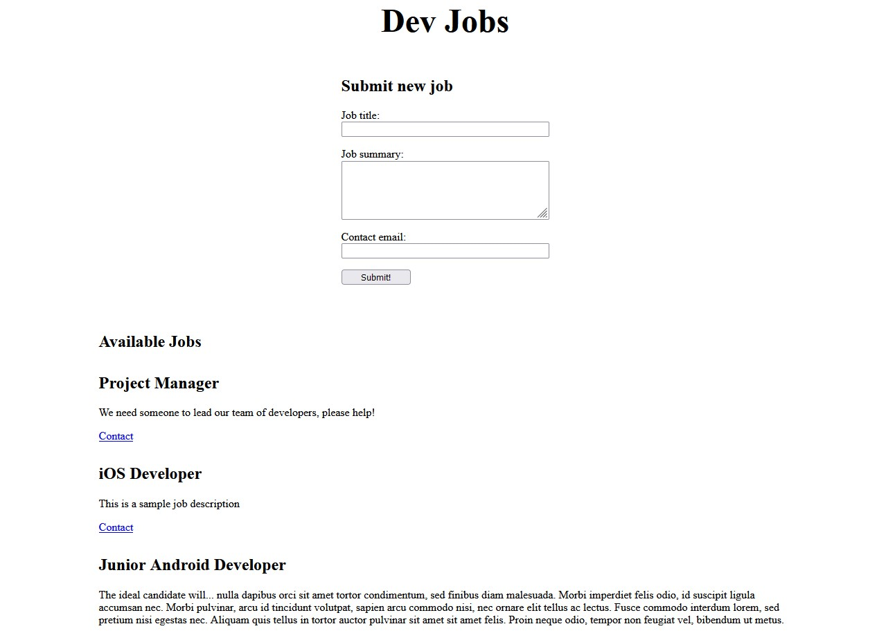

# Chapter 04: Javascript

Our goal for this chapter will be to use Javascript to collect the data from our form, create a new job posting with that data, then add it to the list alongside our existing sample jobs. We would like it to appear at the top (in order from newest to oldest created).

## Javascript Fundamentals

Javascript is an absolutely fantastic programmng language despite its [quirks](https://i.imgur.com/VTxTR6d.png), and once you get your head around them there's [very little you can't do](https://i.imgur.com/uJPnC6m.jpeg).

This tutorial operates under the presumption that you already have enough familiarity with Javascript to write basic programs. If not then you'll definitely want to spend some time giving yourself a crash course. Fortunately most of the best resources in existence are completely free.

### General Reference

There is no better general reference for the entire Javascript language than [javascript.info](https://javascript.info/). If you need a quick refresher on anything this should always be your first stop. It's an incredible resource and completely free.

### Teaching Resources

Although I haven't used it myself, I've heard plenty of good things about the resources at [Free Code Camp](https://www.freecodecamp.org/learn/javascript-algorithms-and-data-structures/#basic-javascript) which are exactly as free as they sound.

Personally my first introduction to Javascript was Douglas Crockford's [Javascript: the Good Parts](https://www.oreilly.com/library/view/javascript-the-good/9780596517748/), which is the subject of some funny and not entirely inaccurate [memes](https://i.redd.it/h7nt4keyd7oy.jpg). It's a relatively quick read that covers the the language really well, and even though it tends to skew a bit toward older syntax, the basic structure and fundamentals of the language that it teaches haven't changed.

### Advanced Resources

For one of the most thorough deep dives into the entire language you should read Kyle Simpson's _You Don't Know JS_ six part series, the 1st edition of which is [free to read on Github](https://github.com/getify/You-Dont-Know-JS/blob/1st-ed/README.md)

Keeping on with books I would also highly recommend Marijn Haverbeke's [The Eloquent Javascript](https://eloquentjavascript.net/) after you've finished with the basics and are ready to go further into the real workings of the language.

## Implementing Javascript into our App

From this point on we are going to presume you have a basic understanding of Javascript.

We will aim to use the proper terminology when describing topics, and make every effort to provide links to the relevant topics (primarily on [javascript.info](https://javascript.info/)) so that you can keep up and learn as you go. We'll do the same thing as well when we get into [Typescript](https://www.typescriptlang.org/) in future chapters.

We will start with how Javascript is integrated into an HTML app. We can embed it directly into our HTML file, or create a separate `.js` file. We'll quickly do the former as an example. 

Let's update our copyright date from a hard coded `2021` value to remain dynamic and update automatically every year:

`index.html`
```html
...
<footer class="app-footer">
  &copy;
  <script>
    document.write(new Date().getFullYear());
  </script>
</footer>
...
```

We have added the `<script>` tag to our footer. Within that tag we can wrie any valid Javascript that we like. `document.write` will output the value of any Javascript expression and embed it right where it's called inside your HTML (similar to `echo` if you are familiar with PHP).

This code will create a new Javascript [Date](https://javascript.info/date#creation) equal to the current date and print out the current year as a string.

## Adding the `script.js` File

Now you will very quickly begin to test the limits of your patience writing JS directly in HTML. Let's create a new `.js` file in your IDE or with this terminal command:

```bash
touch script.js
```

Similar to the CSS file we will need to link to it in our `index.html` file in order to have it run when our app loads. We'll need to add a `<script>` tag with an `src` attribute pointing to your JS file. Your `<head>` should now look like this:

`index.html`
```html
...
<head>
  <meta charset="UTF-8" />
  <meta http-equiv="X-UA-Compatible" content="IE=edge" />
  <meta name="viewport" content="width=device-width, initial-scale=1.0" />
  <link rel="stylesheet" href="styles.css" />
  <!-- NEW -->
  <script src="script.js" defer></script>
  <title>Dev Jobs — Chapter 04</title>
</head>
...
```

You may notice the `defer` attribute. We'll explain why that's there in the next section.

Add the following Javascript code to your new file, then save and refresh your page:

`script.js`
```js
alert("Hello, world!");
```

You should get a prompt in your browser that greets you. That will confirm your JS file is connected properly.


## Querying the DOM

In previous chapters I stressed the importance of learning [CSS Selectors](https://developer.mozilla.org/en-US/docs/Web/CSS/CSS_Selectors) as that knowledge will come in handy again when we begin to implement Javascript.

We'll begin by querying the form itself, as well as each of the individual inputs inside. The reason we need both are:

- We need a reference to the inputs so that we can read the information the employer entered about the job
- We need a reference to the form so that we can reset it when we're done, and so employers can add another job without having to manually clear the fields

To accomplish this we will use `document.querySelector` which uses CSS Selectors to target [DOM nodes](https://developer.mozilla.org/en-US/docs/Web/API/Node). If you're not already familiar with the [DOM](https://developer.mozilla.org/en-US/docs/Glossary/DOM) you should check out these links. Mostly simply put HTML is the blueprint for how to make a site, and the DOM is the browser's actual interpretation of it. Think of it as instructions (HTML) vs construction (DOM). A DOM Node is a piece of a site/app that can be created/updated/removed at any time.

Remove the `alert` statement from your `script.js` file and add the following instead:

`script.js`
```js
// Get a reference to the form DOM node
const jobForm = document.querySelector(".job-form");

// Get the references to each input on the form individually
const newJobTitle = document.querySelector("#job-form-title");
const newJobSummary = document.querySelector("#job-form-summary");
const newJobContactEmail = document.querySelector("#job-form-contact-email");
```

When writing Javascript (and perhaps all languages) it's good practice to try and make the variable names as descriptive as possible to what they actually hold. Don't worry too much about how long the names are (within reason), it's much more important to clearly show your intent.

The `jobForm` variable holds a reference to the DOM node of our `job-form`. If you look at the `index.html` file that is the browser's implementation of our `<form>` tag.

The other three contain references to the DOM nodes of the `input` and `textarea` elements respectively. From those we will be able to pull out the `value` attribute which holds the text the user entered.

Before we continue, use `console.log` to print the value of all four of them to your browser's console. You can access this with the [developer tools](https://developer.mozilla.org/en-US/docs/Learn/Common_questions/What_are_browser_developer_tools) in all the major browsers (usually F12 is the shortcut key). From within the `dev tools` click the `console` tab.

Now add this line to the bottom of your `script.js` file:

`script.js`
```js
console.log(jobForm, newJobTitle, newJobSummary, newJobContactEmail);
```

Save and load your app. The output inside the dev console should look something like this (may depending on the browser, this example is Firefox, relevant part shown with red arrow):

'// There is no red arrow in the screenshot below //'


This is the exact output we're looking for. The `jobForm` variable holds that `<form>` while the other three all hold references to their respective input nodes.

If any of your values show `null` there are two likely reasons:

- You missed the `defer` attribute on the `<script>` tag. What that does is wait to run your Javascript file until after the HTML is loaded. This is necessary otherwise your `querySelector` functions won't find anything because they are in the `<head>` tag and run before the `<form>` is created

- You may have a mismatch on your selector either with the identifier (check for a missing period on class selectors), or just the spelling. Double check to make sure that you you are calling `document.querySelector("#job-form-title")` in your JS, that you actually have an element with an `id` of `job-form-title` in your `index.html` file.

Now that we have that working, let's move to the net piece. Remove the `console.log` statement and add:

`script.js`
```js
// ...
// Get a reference to any existing job post DOM node
const existingJobPost = document.querySelector(".job-post");

// Create a copy of that job post DOM node
const clonedJobPost = existingJobPost.cloneNode(true);
// ...
```

Here we grab a reference to one of our existing `job-post` articles (doesn't matter which one, `querySelector` will return the first result it finds) and then we clone it. We do this to create an exact copy of the DOM structure (based on our HTML template) so we can just update the text values and not have to re-write the whole template.

Use `console.log` to confirm that your `existingJobPost` and `clonedJobPost` variables are defined.

Now lastly, let's set the values of your `clonedJobPost` equal to the text that was entered on the form, and then insert it `after` the `<header>` tag of our `jobs` section so that it appears first in the list.

`script.js`
```js
// ...
// Set the values of the cloned job post equal to the values in the forms
// Note that for the anchor link we use `href` instead of `innerText` and we concatenate `mailto:`
clonedJobPost.querySelector(".job-post-title").innerText = newJobTitle.value;
clonedJobPost.querySelector(".job-post-summary").innerText =
  newJobSummary.value;
clonedJobPost.querySelector(
  ".job-post-contact-email"
).href = `mailto:${newJobContactEmail.value}`;

// Insert the new cloned job with updated values
// immediately after the jobs header tag
document.querySelector(".jobs-header").after(clonedJobPost);
```

If you don't understand what's going on with the `${}` syntax in the `mailto:` string then read up on [template literals](https://developer.mozilla.org/en-US/docs/Web/JavaScript/Reference/Template_literals). It's just a modern readable form of string concatenation, you could accomplish the same thing with the `+` operator.

Now when we load the page we should see a blank job post appear at the top of the list. You'll be able to tell it's there because of the _Contact_ button. But we don't want to just get a blank job post. We want to be able to create our own custom job posts when we click a button.

## Creating a Trigger-able Function

The final step is to wrap our code in a [function](https://javascript.info/function-basics). The complete end result of `script.js` wrapped in a function we've named `formSubmit` looks like:

`script.js`
```js
const formSubmit = () => {
  // Get a reference to the form DOM node
  const jobForm = document.querySelector(".job-form");

  // Get each individual form input
  const newJobTitle = document.querySelector("#job-form-title");
  const newJobSummary = document.querySelector("#job-form-summary");
  const newJobContactEmail = document.querySelector("#job-form-contact-email");

  // Get a reference to any existing job post DOM node
  const existingJobPost = document.querySelector(".job-post");

  // Create a copy of that job post DOM node
  const clonedJobPost = existingJobPost.cloneNode(true);

  // Set the values of the cloned job post equal to the values in the forms
  // Note that for the anchor link we use `href` instead of `innerText` and we concatenate `mailto:`
  clonedJobPost.querySelector(".job-post-title").innerText = newJobTitle.value;
  clonedJobPost.querySelector(".job-post-summary").innerText =
    newJobSummary.value;
  clonedJobPost.querySelector(
    ".job-post-contact-email"
  ).href = `mailto:${newJobContactEmail.value}`;

  // Insert the new cloned job with updated values immediately after the jobs header tag
  document.querySelector(".jobs-header").after(clonedJobPost);

  // Reset the form so that a new job can be entered
  jobForm.reset();

  // Return a false value to prevent the default browser behavior of refreshing
  // the page on form submission
  return false;
};
```

You may notice we've added two extra [statements](https://developer.mozilla.org/en-US/docs/Web/JavaScript/Reference/Statements) near the end:

- `jobForm.reset()` -- this will clear all the input fields on the form when it is submitted.  This will no longer happen automatically when we stop the unnecessary browser refresh when the `submit` button is clicked.  

- `return false` -- when a function attached to an [event listener](https://developer.mozilla.org/en-US/docs/Web/API/EventListener) on a DOM node returns false this prevents some default browser behavior.  In our case it will prevent the page refresh when the form is submitted.

## Attaching our Function to the Button

The last step is to attach our function to the button so that it only runs when the button is clicked.  Let's add an `onsubmit` attribute to our `<form>` tag in `index.html:

`index.html`
```html
...
<form class="job-form" onsubmit="return formSubmit();">
...
```

Normally with a standard function it would only be necessary to write the name of our function `formSubmit`, however the [return](https://developer.mozilla.org/en-US/docs/Web/JavaScript/Reference/Statements/return) here is necessary in order to cancel the browser's default refresh behavior.  

Intersting note is that since we no control when this code is run manually, the `defer` attribute is no longer required on our `<script>` tag.  It's harmless to leave it there however for now.

## Wrapping up

Although our app will look the same visually as the end of Chapter 03, if all has gone well we now have the ability to create new job postings with custom content.  Give it a try!  Here's a screenshot of the current state of the app with two custom posts created and automatically appended with our new JS function:



At this point we have completed all the requirements as written for the frontend.  It's time to move to the backend!