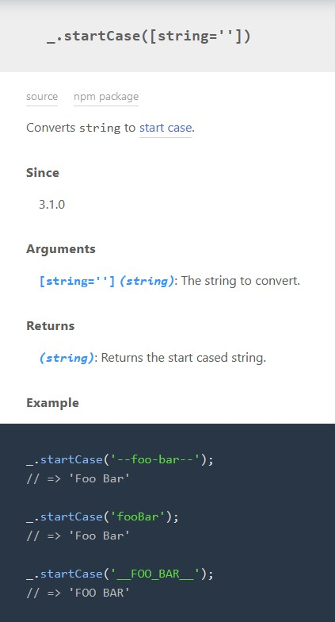
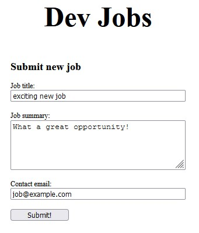
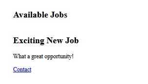

# Chapter 06 - Libraries

Although it's fun to write your own code for all the different parts of your application (well, some find it fun) in the real world we often find that there's no reason to re-invent the wheel. The majority of programming and even web development in general follows the same basic patterns over and over, so to make the most of our time we want to be able to leverage the basic building blocks that have already been established.

Here's a few of the reasons you might choose to and cons of using a library:

- Popular libraries have been rigorously used and tested by the community, particularly [open source](https://en.wikipedia.org/wiki/Open_source) libraries
- Will often be more efficient than code you write yourself due to the amount of time spent working on them and number of different contributors
- Reduce time by avoiding "reinventing the wheel"
- Better handling of [edge cases](https://en.wikipedia.org/wiki/Edge_case), again due to the amount of community usage and feedback
- Reduce the amount of code in your own project that is unrelated to the goals you are actually trying to achieve

So with that in mind, let's consider a situation where you might reach for a Javascript library. This chapter will explain how to install and use one.

We're going to begin by showing the absolute **most basic** of using public Javascript packages. We will cover things like npm, modules, webpack and all that in coming chapters that will explain how to manage large scale projects efficiently.

For now we're just going to focus on the most basic implementation, and work our way up from there.

## Lodash

One of the most popular Javascript utility libraries available is called [lodash](https://lodash.com/). Lodash is a _utility_ library which means it's not built for just one thing, it comes packaged with a ton of different kinds of functions for a variety of different uses. Although it's not quite as much of a "must have" as it used to be, this is mostly due to Javascript itself adopting many similar functions as core to the language rather than it being any less useful than it ever was.

Before we actually add the library, let's discuss a very simple problem we have that might prompt us to use it.

## Identifying a Need

Employers who enter jobs into our system might be really desperate to hire ASAP, and they might be in a bit of a hurry while typing. We'd like the job titles to all be formatted consistently with capital letters, but our current implementation allows users to type anything they like. Let's set up our app so that it automatically coerces job titles to [start case](https://en.wikipedia.org/wiki/Letter_case#Stylistic_or_specialised_usage) (e.g. "android developer" becomes "Android Developer")

As it turns out, Javascript itself comes with some handy methods built right onto strings like `"example".toUpperCase()` which returns "EXAMPLE". A similar method exists for lower case as well. Unfortunately it ends there, nothing about start case is built into the language.

We could write our own, but we'd prefer a community vetted solution. We remember that `lodash` comes with a ton of functions for working on objects, arrays, and strings -- does it include a method to help us with this?

We do a quick Google search for _"lodash start case"_ which brings us to the documentation. A quick `ctrl+f` search on the page brings us [here](https://lodash.com/docs/4.17.15#startCase). Looks like it does! But how do we use it?

## Adding a Javascript Library to our Application

Recall the way that we imported out current `script.js` file into our page, using the `<script>` tag in our `index.html` file. Turns out that's the **only** way to load Javascript into a web page, so that keeps things simple. The nice thing is that the URL of the file we are point to doesn't need to be on our machine. If we simply use `src="script.js"` it will look in the root directory of our project, but if you use `src="www.example.com/script.js` it will download that JS file from the remote source and run it.

We are not going to dive too deep into the topic of security, it's enough to say at this point that although there are of course risks related to running code from an external source you don't control, the majority of those risks can be mitigated by sticking with trusted sources. Stick with packages available on [npm](https://www.npmjs.com/), and if you're just starting out stick to the most popular ones with multi-thousand (or even million) downloads per week. You'll learn through experience how to vet the smaller ones if and when you need them.

When we search for `lodash` on [npm](https://www.npmjs.com/) it will be the first result. For the time being you can ignore the `installation` section. That will show you how to download the library to your own machine once we have a full project environment setup in later chapters. Right now at this stage we don't want to host this package ourselves, just use a version of it that's publically available online.

On the right side you'll see links to both [Lodash's website](https://lodash.com/) and [Lodash's Github repository](https://github.com/lodash/lodash). Both of them include links to the package available on a [content delivery network](https://en.wikipedia.org/wiki/Content_delivery_network) (or CDN). A CDN in a nutshell is basically data that is copied and hosted in many locations instead of one to improve uptime and speed. So if you're in Toronto for example and your machine requests lodash, it would receive a copy fro ma server in Toronto or Montreal, as opposed to London, England.

Clicking the `CDN` link will bring us to a page with a number of options. We want `lodash.min.js`. The `min` refers to a Javascript file which has been [minified](https://developer.mozilla.org/en-US/docs/Glossary/minification) (had the code squaeezed down as much as possible to reduce file size).

Our URL is `https://cdn.jsdelivr.net/npm/lodash@4.17.21/lodash.min.js`.

We take that URL and add it to our `index.js` file:

`index.js`

```html
...
<head>
  <meta charset="UTF-8" />
  <meta http-equiv="X-UA-Compatible" content="IE=edge" />
  <meta name="viewport" content="width=device-width, initial-scale=1.0" />
  <link rel="stylesheet" href="styles.css" />
  <script src="script.js" defer></script>
  <script src="https://cdn.jsdelivr.net/npm/lodash@4.17.21/lodash.min.js"></script>
  <title>Dev Jobs — Chapter 06</title>
</head>
...
```

And that's all there is to it. We can now use any function in our Javascript code. There is no reason to `defer` it since it only provides JS helper methods, it doesn't interact with our page at all.

## Using the Library

Most of the big libraries will include full documentation of their [API](https://developer.mozilla.org/en-US/docs/Glossary/API) so that you can learn exactly how to use them, and `lodash` is no different. The documentation for the most recent version as of this writing is available [here](https://lodash.com/docs/4.17.15).

Learning to read documentation for web libraries (and just any tools in general) is one of the most important skills in a developers toolbelt. A big portion of most jobs entails both identifying _which_ libraries to use, and then once decided, learning _how_ to use that library. There are plenty of tools out there, blog posts, YouTube videos, etc -- but most of the time the best choice really is the tool's own documentation. It's the most likely to be both correct and up to date.

Let's take a look at the documentation for `startCase`:



The underscore you see is `lodash` itself, appropriate of course because that's where the name comes from. All library functions are available on that single character variable for simplicity. We see the `startCase` function takes a single string, and returns a string that has been processed. So let's add it to the `getFormData` function:

`script.js`

```js
// ...
const newJob = {
  title: _.startCase(newJobTitle.value),
  summary: newJobSummary.value,
  contactEmail: newJobContactEmail.value,
};
// ...
```

You can see above that we pass `newJobTitle.value` through the `_.startsWith` method before we add it to our job object.  Let's give it a try.  First we submit a new job all in lowercase...



Then we see it has appeared in our job list in start case!



Great.  We now know how to add libraries to our web project!

## Wrapping Up

So why is it that it seems like project setups are normally so complicated?  Well unfortunately we've glossed over a few downsides with this approach here:

- We've had to load in the entire `lodash` library to only use a single function.  If you look at the contents of [lodash.min.js](https://cdn.jsdelivr.net/npm/lodash@4.17.21/lodash.min.js) you'll see that even though it's about as squished as it can possibly get, you're downloading and running a lot more code than you actually need.  Imagine you're using 10 or even 100 different libraries, and in each case only 1-2 functions from each that creates a lot of extra overhead.  We are going to want a way to only publish the code we actually use.

- We just assume that the `lodash` variable `_` exists in our code everywhere we use it.  What if we added another library that happened to have a variable also named `_`.  Maybe not too likely, but there's nothing technically stopping anyone from declaring it.  This is called polluting the [global scope](https://developer.mozilla.org/en-US/docs/Glossary/Global_scope) and it's considered bad practice.  Modern development tooling has ways to avoid doing this via `import` and `export` that we'll learn about in coming chapters.

- What if the `CDN` goes down?  Our site will stop working properly if `jsdelivr` becomes unavailable.  If we download and package the `lodash` library with our app instead of relying on an external link, then we can better guarantee it will contintue to function for a much longer period of time.

These pitfalls are just a few examples from a longer list of reasons why the Javascript ecosystem has grown in complexity.  Although this complexity can certainly be frustrating, particularly for newcomers, as you learn more about it you'll better understand why it's necessary and why it's actuall yas *good thing* overall to have so many options to be able to build and create any kind of application you can imagine.

In the next chapter we'll start to look at how we can set up these modules, and create the template for an application with the ability to scale in size as big as we can imagine.