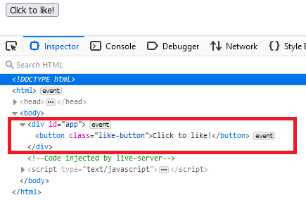
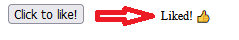
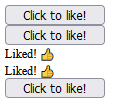

# Understanding the Modern Web Stack: React & JSX

## Prerequisites

You will need to have [Node.js](https://nodejs.org/en/download/) installed on your machine and available from your terminal. Installing Node will automatically install [npm](<https://en.wikipedia.org/wiki/Npm_(software)>) as well, which is what you will use to install Babel.

If you see version numbers when running the two commands below (your numbers will likely be different than this example) then you are ready to go:

```bash
node --version
> v15.5.0

npm --version
> 7.16.0
```

You will need a solid understanding of [Javascript](https://developer.mozilla.org/en-US/docs/Web/JavaScript).  

Not only do you need to have a good grasp on the fundamentals (strings, numbers, arrays, objects, functions), but there are a number of other Javascript patterns that appear frequently in React codebases.  Here is a non-exhaustive list of some of the ones that come up frequently:

- [Destructuring assignment](https://javascript.info/destructuring-assignment)
- [Arrow functions](https://javascript.info/arrow-functions-basics)
- [Conditional (ternary) operator](https://javascript.info/ifelse#conditional-operator)
- [Class syntax](https://javascript.info/class)
- [Template strings](https://javascript.info/string#quotes)
- [Mouse events](https://javascript.info/mouse-events-basics)

You will want to ensure you understand what each of these are before you begin your React journey, that way you can focus all your attention on React patterns rather than on Javascript itself.  If you are unfamiliar with any of the above then it would be worth your time to work your way through the fundamentals sections of [javascript.info](https://javascript.info/).

You will also want to have a good understanding of what the [DOM](https://developer.mozilla.org/en-US/docs/Web/API/Document_Object_Model) is.  In particular, DOM methods like [Document.querySelector()](https://developer.mozilla.org/en-US/docs/Web/API/Document/querySelector).  Although one of the main purposes of React is to provide an environment where we don't need these methods at all, understanding them will give you a significant leg up in understanding why React was created and what problems it solves.

## Initializing the Project

Let's start by initializing a new `npm` project. Run the following command to generate one:

```bash
npm init -y
```

The `-y` flag will automatically select default values for everything, which is appropriate in our example.

## Installing React

Next we will add React to our project:

```bash
npm install react react-dom
```

Let's take a look at what each one is doing:

- `react` serves as the core engine that manages all the components and their states.
- `react-dom` is what allows it to do its work on our DOM elements in our web application. The reason they are separate is that gives React the flexibility to work on other environments beyond just the web browser.  Another environment besides the DOM where React can operate is on mobile devices through [React Native](https://reactnative.dev/) for example.

So to begin, we will create our first React element. Let's start by loading our library from `node_modules`. Presuming that `index.html` and `node_modules` are in the same directory:

`index.html`

```html
<!DOCTYPE html>
<html>
  <head>
    <meta charset="UTF-8" />
    <script src="node_modules/react/umd/react.development.js"></script>
    <script src="node_modules/react-dom/umd/react-dom.development.js"></script>
    <script src="script.js" defer></script>
  </head>
  <body>
    <div id="app"></div>
  </body>
</html>
```

It's important that our `<script>` tag for our own `script.js` file has the `defer` attribute.  The reason being that we need the `<div>` with the `id="app"` to exist before our React code runs so that it has somewhere to mount to.  

## Creating our First Component

Next let's create our `script.js` file with our first component. Our first component will be a simple button, and along the same lines as the official React documentation, it will be "like" button:

`script.js`

```js
const LikeButton = () => {
  return React.createElement(
    "button",
    { className: "like-button" },
    "Click to like!"
  );
};

const domContainer = document.querySelector("#app");

ReactDOM.render(React.createElement(LikeButton), domContainer);
```

React elements are reacted with the `React.createElement` function. It takes three parameters:

1. The type of element. If this is a string it will create a DOM node of that type, a `button` in our example will create a `<button>` element. This can also be another React component instead of a string.

2. The [props](https://reactjs.org/docs/components-and-props.html#rendering-a-component) of the component. These are similar to [HTML attributes](https://developer.mozilla.org/en-US/docs/Web/HTML/Attributes) and in fact will extend the attributes if you are using them directly on an HTML element like our `button` here. You can also define your own custom props to make your components more reusable. If your component has no props this can be `null`. Some attributes in React are slighly different from their HTML counterparts: for example `className` instead of `class` due to the term `class` being already reseved in JS to refer to a [class](https://developer.mozilla.org/en-US/docs/Web/JavaScript/Reference/Classes).

3. The `children` of an element, which is how you create the standard nesting behavior of DOM nodes. The children can be a string, or more React elements. Components can have as many children as they want. In our case the child is simply text.

The `React.render` function takes our `LikeButton` component and mounts it on any DOM node that we pass to it. Once the initial compoinent is mounted everything from that point on can be created inside of that root node. The `document.querySelector("#app")` call that we make to get the mounting node should the the _only_ manual call to querySelector in our entire React application.

Based on our understanding of these functions, we would expect this to create a DOM structure that looks like:

```html
<div id="app">
  <button class="like-button">Click to like!</button>
</div>
```

Give it a try now and serve up your `index.html` and take a look at the output.  You should have a button on your page with a DOM structure as shown in the below screenshot:



## Functional Components and Class Components

Although this tutorial focuses on the more modern method of creating [components as functions](https://reactjs.org/docs/components-and-props.html), it is important to make sure you are also familiar with the older style of creating [components as classes](https://reactjs.org/docs/react-component.html).

Class components are still fully supported in React and you're still very likely to encounter them in real codebases and projects, so understanding how they work is important. For most users, particularly those just learning React, there is no difference. For more advance users there are a small subset of scenarios where class components are still required (e.g. [error boundaries](https://reactjs.org/docs/error-boundaries.html)).

Most new features in React are designed around functional components (e.g. [hooks](https://reactjs.org/docs/hooks-intro.html)) so for new projects and people learning the library, functional components are recommended. In practice the best choice is to follow whatever convention your team has established.

If you're curious, here's how our `LikeButton` component would look using `class` syntax.  You do not need to update your code as this is only for demonstration.  A little bit more verbose, but accomplishes the same behavior:

```js
class LikeButton extends React.Component {
  constructor(props) {
    super(props);
    this.state = { liked: false };
  }

  render() {
    if (this.state.liked) {
      return React.createElement("span", null, "Liked!");
    }

    return React.createElement(
      "button",
      {
        className: "like-button",
        onClick: () => this.setState({ liked: true }),
      },
      "Click to like!"
    );
  }
}

const domContainer = document.querySelector("#app");

ReactDOM.render(React.createElement(LikeButton), domContainer);

```

_(Note that this is only for demonstration, our tutorial will continue with the existing functional component syntax)_

## Making our Button "Reactive"

You may have noticed that despite saying "click to like", our button doesn't actually have any click functionality. Let's say that when the button is clicked, we would like it to disappear and be replaced with an `<span>` tag that says "Liked!".

If were were using plain old Javascript that would require us to use a lot of manual DOM methods, including `querySelector` to select all the nodes we are working with, as well as `createElement` to create our new `<span>` and `appendChild` to add it as a child to our `#app` node.

Let's see how to accomplish the same thing using React, without the need for any DOM methods. We'll do this in a two-step process to help understand the concept of [state](https://reactjs.org/docs/state-and-lifecycle.html) in a component.

Replace the content of `script.js` with the new code below:

`script.js`

```js
const LikeButton = () => {
  let liked = false;

  if (liked) {
    return React.createElement("span", null, "Liked!");
  }

  return React.createElement(
    "button",
    {
      className: "like-button",
      onClick: () => {
        liked = true;
        console.log("button was clicked");
      },
    },
    "Click to like!"
  );
};

const domContainer = document.querySelector("#app");

ReactDOM.render(React.createElement(LikeButton), domContainer);
```

_(Note that in React, the normal lowercase `onclick` attribute you use in HTML files becomes the more Javascript idiomatic `onClick`. Make sure to be aware of this subtile difference. To help avoid this common syntax error you can use a `linter`, which will be discussed further in upcoming tutorials)._

You can see that the initial state of our `LikeButton` component is that `liked` is `false`. We're not going to render the `span` because that only occurs when `liked` is `true`. We render a `button` with an `onClick` event handler that will set the value of `liked` to `true`. 

You can confirm the `onClick` handler is running by viewing the dev console and seeing out "button was clicked" message. Unfortunately despite being logically sound, the state of the button doesn't change.

Although we confirm that we are changing the value of `liked`, our issue is that there is nothing specifically telling React _"hey, our component has changed, can you please render it again and update the DOM for us with the new state?"_

What we have to do is introduce a method to inform React about the changing [state](https://reactjs.org/docs/state-and-lifecycle.html) of our component. We can do that with the [setState](https://reactjs.org/docs/hooks-state.html) hook.

Our updated `LikeButton` now looks like this:

`script.js`

```js
const LikeButton = () => {
  const [liked, setLiked] = React.useState(false); // <-- NEW

  if (liked) {
    return React.createElement("span", null, "Liked!");
  }

  return React.createElement(
    "button",
    {
      className: "like-button",
      onClick: () => {
        setLiked(true); // <-- NEW
        console.log("button was clicked");
      },
    },
    "Click to like!"
  );
};

const domContainer = document.querySelector("#app");

ReactDOM.render(React.createElement(LikeButton), domContainer);
```

You can see two small changes highlighted with the `// <-- NEW` comment.

The first line in our updated `LikeButton` function component uses Javascript's [array destructuring](https://javascript.info/destructuring-assignment#array-destructuring) syntax. Make sure you have a good familiarity with that syntax so that you don't confuse it with the `useState` function itself.

React's `useState` function returns an array with two values: 
1. The first is a variable with the same value that was passed (in our case `liked` which will be `false`). 

2. The second array value is a `function` that is used to change the value of `liked` in a way that React will respond to and [re-render](https://reactjs.org/docs/rendering-elements.html) the component (update the DOM with the new state).

Stateful variables keep their value even when the component re-renders.  They will not be reset to defaults. This is what causes the component to now take the conditional `if` branch and render the `span` element instead of the `button`. 

Try it yourself!



## Moving on

We've now created our first React component that manages its own state without the use of DOM methods. It might be a bit difficult to see the real advantage of this at such a small scale. Let's try and imagine how this might come in handy at a larger scale.

Imagine you have a Facebook-like interface with 5 posts, each with their own like button. If using traditional DOM methods, you would need to use make sure you could target the specific button that was clicked and update it. This might get fairly complicated depending on what kind of selector you are using. 

With our button that handles its own state, it's as easy.  We create a wrapper `<div>` with a few styles to display the buttons as a vertical column.  Within that wrapper are five separate `LikeButtons` each with their own independent state:

`script.js`

```js
// ...
const domContainer = document.querySelector("#app");

const manyButtons = React.createElement(
  "div",
  { style: { width: "100px", display: "flex", flexDirection: "column" } },
  React.createElement(LikeButton),
  React.createElement(LikeButton),
  React.createElement(LikeButton),
  React.createElement(LikeButton),
  React.createElement(LikeButton)
);

ReactDOM.render(manyButtons, domContainer);
```



This same basic paradigm can be extended as far as you can imagine to creater larger and more complex components, each with or without their own state, and with children that also manage their own state.  Combined together you can create a fully reactive application.

At this stage is when you start to see how the `React.createElement` syntax can begin to feel pretty cumbersome.  That's where [JSX](https://reactjs.org/docs/introducing-jsx.html) comes into play.

## JSX

In this section we'll learn what JSX is and how to configure your environment to write your React components in JSX.  

## What is JSX?

JSX is simmply a syntax extension of the Javscript language.  It's not quite Javascript, but it's not HTML either.  It's goal is to provide you with the tools to write your components in a way that describes how you want them to appear.  

## JSX Prerequisites

Browsers do not inherently understand JSX so we need some kind of translation tool.  That tool is called [Babel](https://babeljs.io/).  

This tutorial will presume you have a solid understanding of how to setup Babel before you continue further.  Check out the previous tutorial _Understanding the Modern Web Stack: Babel_ to get up to speed with everything you need to know.

## Installing Babel and @babel/preset-react

Run the following command from the root directory of your project:

```bash
npm install @babel/core @babel/cli @babel/preset-env @babel/preset-react --save-dev
```

The first three dependencies were described in the previous tutorial, the new one is:

- `@babel/preset-react` - This preset understands how to parse JSX and transform it into Javascript code that the browser can process.

Next we need to add instructions for Babel so it knows to use the `preset-react` when its run.  Update your `package.json` file with the following:

`package.json`
```json
{
  "dependencies": {
    "react": "^17.0.2",
    "react-dom": "^17.0.2"
  },
  "devDependencies": {
    "@babel/cli": "^7.15.7",
    "@babel/core": "^7.15.5",
    "@babel/preset-env": "^7.15.6",
    "@babel/preset-react": "^7.14.5"
  },
  "browserslist": [
    "last 2 Chrome versions"
  ],
  "babel": {
    "presets": [
      [
        "@babel/preset-env"
      ],
      [
        "@babel/preset-react"
      ]
    ]
  }
}
```

Babel presets are run in reverse order, so Babel will first run the `preset-react` to transform the JSX to Javascript, then it will run the `preset-env` to transpile our code to accommodate our target browsers (in this case last 2 Chrome versions, so little if anything should change).

## Converting our LikeButton to JSX

JSX files require a special extension to help the tooling understand when JSX is being used.  If you are writing JSX in a Javascript file then simply change the extension from `.js` to `.jsx`.

Here's what our new `script.jsx` file looks like updated to use JSX:

```jsx
const LikeButton = () => {
  let [liked, setLiked] = React.useState(false);

  if (liked) {
    // return React.createElement("span", null, "Liked! 👍");
    return <span>Liked! 👍</span>;
  }

  return (
    <button
      className="like-button"
      onClick={() => {
        setLiked(true);
      }}
    >
      Click to like!
    </button>
  );
};

const domContainer = document.querySelector("#app");

const ManyButtons = () => {
  return (
    <div style={{ width: "100px", display: "flex", flexDirection: "column" }}>
      <LikeButton />
      <LikeButton />
      <LikeButton />
      <LikeButton />
      <LikeButton />
    </div>
  );
};

ReactDOM.render(<ManyButtons />, domContainer);
```

Note how much easier it is to reason about what the actual application is going to look like when it renders.  In particular the `ManyButtons` component makes it much clearer that you will be rendering a `<div>` wrapper with five `LikeButtons` inside of it.  

We've also left in one comment above our `<span>` to show a quick comparison between the standard `React.createElement` syntax and JSX.

Now let's transform it into raw Javascript so the browser can use it.  Run the following command:

```bash
npx babel script.jsx --out-file script.js`
```

There should be no need to update your `index.html` file since it originally pointed to `script.js`, and that is the filename of our output.  If we take a look at the file that Babel has created it looks like:

`script.js`
```js
"use strict";

const LikeButton = () => {
  let [liked, setLiked] = React.useState(false);

  if (liked) {
    // return React.createElement("span", null, "Liked! 👍");
    return /*#__PURE__*/React.createElement("span", null, "Liked! \uD83D\uDC4D");
  }

  return /*#__PURE__*/React.createElement("button", {
    className: "like-button",
    onClick: () => {
      setLiked(true);
    }
  }, "Click to like!");
};

const domContainer = document.querySelector("#app");

const ManyButtons = () => {
  return /*#__PURE__*/React.createElement("div", {
    style: {
      width: "100px",
      display: "flex",
      flexDirection: "column"
    }
  }, /*#__PURE__*/React.createElement(LikeButton, null), /*#__PURE__*/React.createElement(LikeButton, null), /*#__PURE__*/React.createElement(LikeButton, null), /*#__PURE__*/React.createElement(LikeButton, null), /*#__PURE__*/React.createElement(LikeButton, null));
};

ReactDOM.render( /*#__PURE__*/React.createElement(ManyButtons, null), domContainer);
```

You'll notice it looks a lot like our original code before we used JSX.  Now you can see how JSX allows us to write our components in a way that's easier for ourselves to reason about as human developers, and we can rely on our tools to convert them into raw Javascript when we're finished.

_(If you're curious about the [PURE comments](https://babeljs.io/blog/2018/08/27/7.0.0#pure-annotation-support) they are annotations to help bundlers and minifiers remove unused code)_

## Wrapping Up

You should now have a solid grasp of the fundamentals of what React and JSX are, and how you can use them in your modern web stack to write more efficient and maintainable applications.  

To continue your web development journey, check out some of my other tutorials in the _Understanding the Modern Web Stack_ series.  Thanks for reading!

