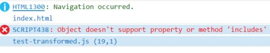
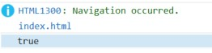

# Babel

```bash
npm install @babel/core @babel/cli @babel/preset-env --save-dev
```

Let's take a look at what each one is doing:

- `@babel/core` - This is the main engine that knows how to transform code based on a set of instructions it is given
- `@babel/cli` - This is the actual program we are going to run to trigger the core engine and output a transformed Javascript file
- `@babel/preset-env` - This is a preset that tells the core engine what kind of transformations to make. It looks at your environment (in our case it will be our `package.json` file) to determine what kind of changes need to be made depending on the browsers you wish to support.


We need to add a couple values to our `package.json` file:

- `browserslist` - This tells `babel` which browsers we are aiming to target. The older / less supported they are, the more work and more transformations `babel` will have to make in order for your application to work in these browsers. The syntax is a simple array of strings which you can [learn about here](https://github.com/browserslist/browserslist).
- `babel` - This is where we defined all the presets that we will use, as well as any configuration options related to those presets. We will start with the simplest one, `@babel/preset-env`

So our `package.json` file should look like this:

`package.json`

```json
{
  "devDependencies": {
    "@babel/cli": "^7.15.7",
    "@babel/core": "^7.15.5",
    "@babel/preset-env": "^7.15.6",
  },
  "browserslist": ["last 2 Chrome versions"],
  "babel": {
    "presets": [["@babel/preset-env"]]
  }
}
```

The `devDependencies` should already be there from your `npm install`. The other two properties described above you will need to add yourself.

Now let's create a simple test file:

`test.js`

```js
const x = 5;

let y = 6;

const sampleFunction = () => "some return value";

class Person {
  constructor(name, age) {
    this.name = name;
    this.age = age;
  }
}

[1, 2, 3].includes(3);
```

At its most basic configuration `babel` will transform your [ES6](https://www.w3schools.com/js/js_es6.asp) syntax into the much wider supported [ES5](https://www.w3schools.com/js/js_es5.asp).

In the above example `const`, `let`, the `arrow function`, `includes` array method and `class` are all features of ES6 that won't run properly in older browsers such as `Internet Explorer 11` (which unfortunately some organizations still use extensively even in 2021).

Let's begin with a simple example. Run the following command in your project root directory containing your `package.json` file and your `test.js` file:

```bash
npx babel test.js --out-file test-transformed.js
```

Presuming you have followed all the instructions so far you should see a new file created called `test-transformed.js` that looks like this:

`test-transformed.js`

```js
"use strict";

const x = 5;
let y = 6;

const sampleFunction = () => "some return value";

class Person {
  constructor(name, age) {
    this.name = name;
    this.age = age;
  }
}

const hasThree = [1, 2, 3].includes(3);
console.log(hasThree);
```

Not much different right? Aside from adding [strict mode](https://developer.mozilla.org/en-US/docs/Web/JavaScript/Reference/Strict_mode) nothing has actually changed. The reason for this is because of how we have configured our environment in `package.json`, which is where `@babel/plugin-env` looks in order to decide what it should do.

`package.json`

```json
...
"browserslist": [
  "last 2 Chrome versions"
],
...
```

Since we are only targeting the most recent 2 versions of Chrome, `babel` knows that we have no problem including all the modern JS syntax that we want, it will work fine in those modern browsers.

But let's say that we are required to support `Internet Explorer 11`. We don't want to have to change the way we write our code just to accommodate that browser, but fortunately that's where `babel` saves the day. Update your `package.json` to add `IE 11` to your `browserslist` array:

```json
...
"browserslist": [
  "last 2 Chrome versions",
  "IE 11"
],
...
```

Now run this command again:

```bash
npx babel test.js --out-file test-transformed.js
```

Take a look at the output this time:

`test-transformed.js`

```js
"use strict";

function _classCallCheck(instance, Constructor) {
  if (!(instance instanceof Constructor)) {
    throw new TypeError("Cannot call a class as a function");
  }
}

var x = 5;
var y = 6;

var sampleFunction = function sampleFunction() {
  return "some return value";
};

var Person = function Person(name, age) {
  _classCallCheck(this, Person);

  this.name = name;
  this.age = age;
};

var hasThree = [1, 2, 3].includes(3);
console.log(hasThree);
```

This looks a lot different from our original file! Notice that almost all the `ES6` terms we discussed above are gone, `const` is replaced with `var`, our arrow function is replaced with `function` syntax, and our `class` has been transformed into a basic Javascript [object](https://javascript.info/object). We can now take this `test-transformed.js` file, serve it up to `Internet Explorer 11` and it would run just fine... almost!

We still have one small problem. The `includes` method was not transformed. Why is that? To understand the reason, we first need to understand `polyfills`.

## Polyfills

To understand why we need `polyfills` we have to understand the difference between what is new `syntax` and what is new `functionality`. The `includes` method is new `functionality`. It has its own logic behind it, and simply changing the syntax of how the code is written won't explain to older browsers how the logic of the `includes` method is supposed to function.

For new features that introduce new functionality we need something called a [polyfill](https://developer.mozilla.org/en-US/docs/Glossary/Polyfill). Polyfills are simply just the source code for a method like `includes` that you bundle along with your application to essentially teach older browsers how it works.

You do not need to write polyfills yourself, polyfills for just about every feature of JS already exist and are easy to include. In future tutorials we will get into bundling and only including the specific ones that we need, but until then we can simply include a library called [core-js](https://www.npmjs.com/package/core-js) and instantly give our app access to all modern JS features even on older browsers.

To test it out let's load the entirety of the `core-js` library into our app. Since we are still not yet using a bundler, we will simply load the already bundled and `minified` version from the web into our app. If you don't already have an `index.html` template, create this file in your project root directory:

`index.html`

```html
<!DOCTYPE html>
<html>
  <head>
    <meta charset="UTF-8" />
    <script src="test-transformed.js" defer></script>
  </head>
  <body>
    <div id="app"></div>
  </body>
</html>
```

We'll begin by trying to load the file in `IE 11`. If your machine doesn't have Internet Explorer 11, you can simply follow with the example here. Though I am using `Windows 11` which has removed `IE 11` entirely, `Microsoft Edge` comes with an [IE 11 Mode](https://docs.microsoft.com/en-us/deployedge/edge-ie-mode) for testing applicaitons that require backward compatibility. That is what I am using here.

When we run `babel` and try to load our `test-transformed.js` file in `IE 11` we get the following error on the console:



Now let's add the `core-js` library to a `<script>` tag inside the `<head>` in our `index.html`:

`index.html`

```html
...
<head>
  <meta charset="UTF-8" />
  <script src="https://cdnjs.cloudflare.com/ajax/libs/core-js/3.18.1/minified.js"></script>
  <script src="test-transformed.js" defer></script>
</head>
...
```

When we reload the page in `IE 11` we get:



It works! We're writing modern Javascript and running it in an old dinosaur browser! That's great!

Now that we have a basic understand of what `babel` is and how it works, the next step is to configure it to transform our `react` code and introduce [JSX](https://reactjs.org/docs/introducing-jsx.html).